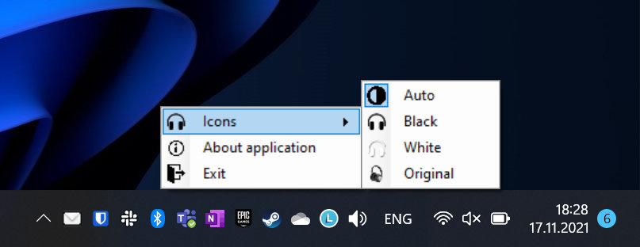
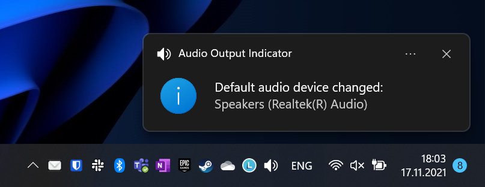

# Audio Output Indicator #
### You can easily check if laptop audio is connected to your bluetooth headphones or default speakers ###

- .Net Core application
- Displays icon of current audio device in tray
- Notify user about audio device change

